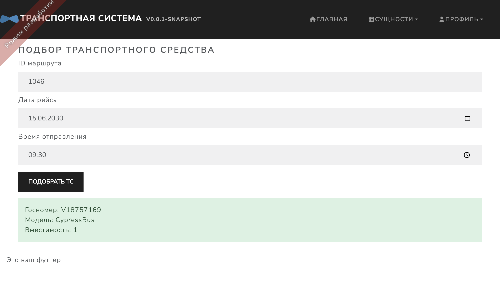

<!-- _class: lead -->
<!-- _footer: '' -->

# Проектирование и разработка информационной системы по подбору и учёту работы городского пассажирского транспорта

**Выпускная квалификационная работа**

Студент: **Халитов Адель Марсович**, группа **ДЗПИж-210**  
Университет управления «ТИСБИ», **2026**

*Работа выполнялась совместно с научным руководителем.*

---

## Постановка задачи

**Актуальность:** ручной подбор ТС, запаздывающий контроль выезда → простои и срыв интервалов.

**Цель:** ИС для **подбора транспорта на маршруты** и **учёта работы** на предприятии.

**Задачи:** анализ предметной области и аналогов; ТЗ; проектирование БД и архитектуры; реализация; тестирование; оценка экономической эффективности.

**Объект** — деятельность транспортного предприятия. **Предмет** — методы проектирования и разработки ИС подбора и учёта.

---

## Требования и пользователи

**Функции:** справочники; **автоподбор** ТС; рейсы и путевые листы; события; отчёты.

**Веб-приложение** в браузере; разграничение доступа по ролям.

| Роль | Функции |
|------|---------|
| Диспетчер | подбор, рейсы, путевые листы |
| Администратор | справочники, пользователи |
| Руководитель | отчёты |

---

## Сравнение с аналогами

| Критерий | 1С | Автопарк | Wialon | Excel | **ИС ВКР** |
|----------|:--:|:--------:|:------:|:-----:|:----------:|
| Подбор на маршрут | +/- | − | − | − | **+** |
| Учёт рейсов | + | +/- | +/- | +/- | **+** |
| Стоимость | высокая | подписка | высокая | низкая | **разовая** |

**Вывод:** нужна специализированная ИС с **автоподбором** и учётом рейсов.

---

## Средства реализации

| Часть | Технологии |
|-------|------------|
| Клиент | **HTML**, **CSS**, **JavaScript** |
| Сервер | **Java 21**, **Spring Boot** |
| СУБД | **PostgreSQL** |
| Сборка / миграции | **Maven**, **Liquibase** |
| Тесты | JUnit 5, Testcontainers, Cypress |
| Графики | Mermaid, PlantUML |

Каркас проекта — **JHipster 9.x** (аутентификация, структура REST + SPA).

---

<style scoped>
p { text-align: center; }
</style>

## Диаграмма вариантов использования


---

<style scoped>
p { text-align: center; }
</style>

## Диаграмма классов


---
<style scoped>
p { text-align: center; }
</style>

## Процесс подбора ТС


---

## Экономический расчёт (затратный метод)

<div class="cols">
<div>

| Показатель | Значение |
|------------|----------|
| Трудоёмкость проекта | **824** чел.-часа |
| **Средняя ставка команды** | **1 500** руб./час |
| Прямые затраты (все роли) | **1 271 200** руб. |
| **Дополнительные расходы** | **304 240 руб.** | 

</div>

<div>

| Статья | Сумма, руб. |
|--------|------------|
| Аренда серверного оборудования (VPS, 1 год) | 50 000 |
| Ноутбуки для разработчиков (2 × 70 000) | 140 000 |
| Прочие накладные (связь, электроэнергия) | 114 240 |
| **Итого доп. расходы** | **304 240** |

</div>
</div>


**Стоимость разработки:** **1 575 440** руб.

---

## Подбор ТС — интерфейс и код

<div class="cols">

<div>



</div>

<div>

```typescript
// trip-suggestion.tsx
const suggestVehicle = async () => {
  const response = await axios.post(
    '/api/trips/suggest-vehicle', form
  );
  setResult(response.data);
};
```

```java
// TripResource.java
@PostMapping("/suggest-vehicle")
public ResponseEntity<Vehicle> suggestVehicle(
    @RequestBody TripSuggestionRequest request) {
  return tripService.suggestVehicleForTrip(request)
    .map(ResponseEntity::ok)
    .orElse(ResponseEntity.noContent().build());
}
```

</div>

</div>

---

## Путевой лист — интерфейс и код

<div class="cols">

<div>


</div>

<div>

```java
// WaybillResource.java
@PostMapping("/{id}/departure")
public ResponseEntity<Waybill> registerDeparture(
    @PathVariable Long id, @RequestBody WaybillActionRequest req) {
  return ok(waybillService.registerDeparture(
    id, req.getEventTime(), req.getMileage()));
}
```

```java
// WaybillService — смена статуса рейса
trip.setStatus(TripStatus.ONGOING);  // выезд
trip.setStatus(TripStatus.COMPLETED); // возврат
```

</div>

</div>

---

## Dashboard — интерфейс и код

<div class="cols">

<div>


</div>

<div>

```typescript
// dashboard.tsx — запрос сводки по парку
axios.get<FleetStats>('/api/reports/fleet')
  .then(r => setStats(r.data));
axios.get('/api/reports/trips/monthly', {
  params: { year, month }
});
// обновление каждые 45 с (polling)
```

</div>

</div>

**Панель:** всего / исправных / в ремонте; отчёт за месяц; простои по дате.

---

## Заключение

**Сравнительный анализ аналогов** — целесообразна собственная ИС с подбором ТС и учётом рейсов  

**Проектирование** — модели данных и процессов согласованы с реализацией  

**Экономический расчёт** — **1 575 440** руб. (1 271 200 + 304 240)  

**Реализация** — веб-ИС (Java, Spring Boot, React, PostgreSQL), пилотное внедрение  

- автоподбор ТС · рейсы и путевые листы · отчёты · роли · браузерный доступ  

---

<!-- _class: lead -->
<!-- _footer: '' -->

# Спасибо за внимание!

**Вопросы?**

Халитов А. М. · ДЗПИж-210 · 2026
